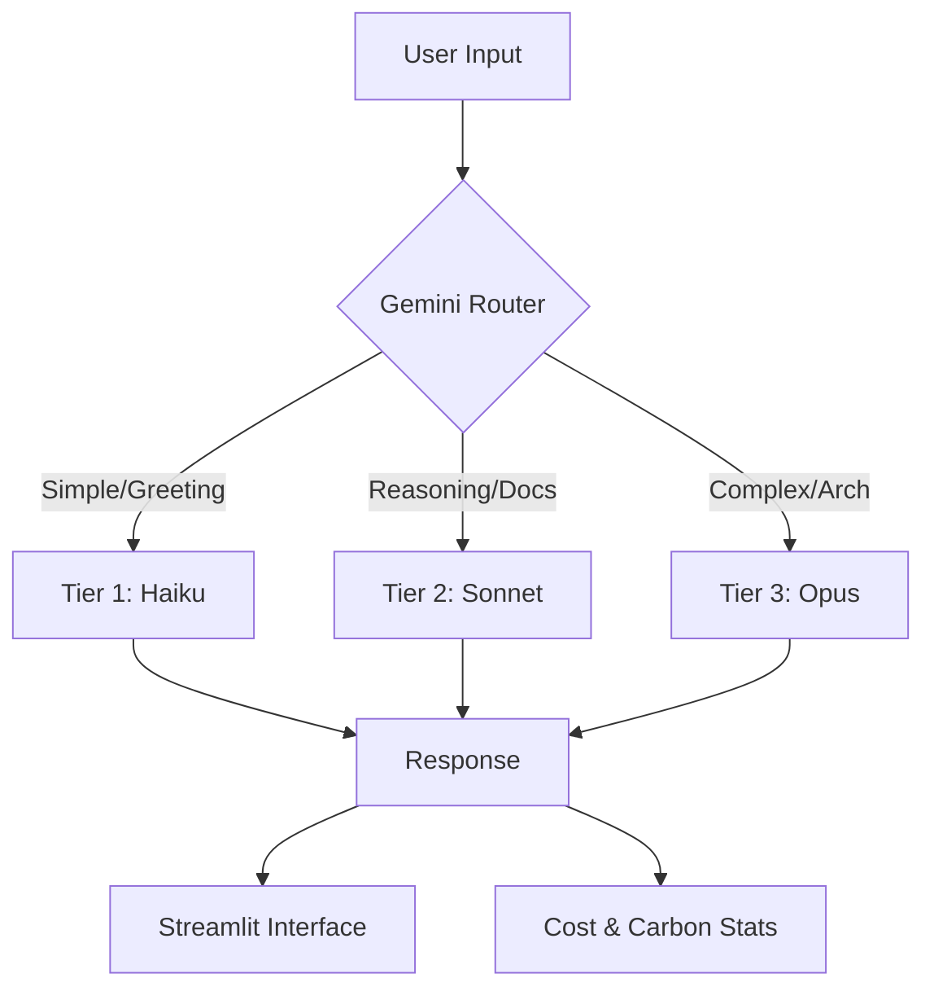

# Egnyte Copilot: Intelligent Enterprise AI Orchestrator


**Egnyte Copilot** is a next-generation enterprise assistant that optimizes for **accuracy, cost, and latency** by dynamically routing user queries to the most appropriate Large Language Model (LLM).

Instead of relying on a single, expensive model for all tasks, Egnyte Copilot uses a **Gemini-powered Decision Engine** to analyze query intent and complexity in real-time, routing tasks between **Claude Haiku**, **Sonnet**, and **Opus**.

---

## 🚀 Key Features

### 🧠 Intelligent Model Routing (The "Brain")
* **Zero Heuristics:** We don't use brittle "if/else" keyword matching.
* **Semantic Analysis:** Every user query is analyzed by **Google Gemini Flash** to determine intent, complexity, and risk.
* **Transparent Reasoning:** The system explains *why* a specific model was chosen (e.g., *"Selected Haiku because this is a simple greeting, saving 98% cost"*).

### ⚡ Multi-Tier Execution Architecture
* **Tier 1 (Speed & Efficiency):** **Claude Haiku** for greetings, formatting, and simple data extraction.
* **Tier 2 (The Generalist):** **Claude Sonnet** for reasoning, file summarization, and factual lookups.
* **Tier 3 (Deep Intelligence):** **Claude Opus** for system architecture, complex debugging, and security audits.

### 🏢 Enterprise-Ready UI
* **Brand Consistency:** Custom-styled Streamlit interface matching Egnyte’s official design system (Navy/Teal/White).
* **Smart Code Rendering:** Custom-built code blocks with syntax highlighting and copy-paste functionality, optimized for light-mode readability.
* **Analytics Dashboard:** Real-time tracking of:
    * 💸 **Cost Savings** (vs. using Opus for everything)
    * ⏱️ **Time Saved** (Latency optimization)
    * 🌱 **Carbon Footprint Reduction**

---

## 🛠️ Tech Stack

| Component | Technology | Description |
| :--- | :--- | :--- |
| **Frontend** | Streamlit (Python) | Custom CSS, Session State management, Streaming responses. |
| **Router** | Google Gemini Flash | Ultra-fast intent classification and routing logic. |
| **Execution** | Anthropic Claude 3.5 | Haiku, Sonnet, and Opus via Vertex AI. |
| **Infrastructure** | Google Cloud Vertex AI | Enterprise-grade security and model serving. |
| **Image Processing** | Pillow / Base64 | Handling multimodal inputs (images/diagrams). |

---

## 🏗️ Architecture Flow



---

## ⚙️ Installation & Setup

1. **Clone the Repository**
    ```bash
    git clone https://github.com/AlapatiChandrasekhar/intelligent_model_router.git
    cd intelligent_model_router
    ```

2. **Create Virtual Environment**
    ```bash
    python -m venv .venv
    source .venv/bin/activate  # On Windows: .venv\Scripts\activate
    ```

3. **Install Dependencies**
    ```bash
    pip install -r requirements.txt
    ```

4. **Configure Environment**
    Create a `.env` file in the root directory. This project uses Google Cloud Vertex AI for authentication.

    ```ini
    # .env file
    GOOGLE_CLOUD_PROJECT="your-gcp-project-id"
    GOOGLE_CLOUD_LOCATION="us-central1"
    ```
    *Note: Ensure you have authenticated via CLI using `gcloud auth application-default login`.*

5. **Run the Application**
    ```bash
    streamlit run app.py
    ```

---

## 📂 Project Structure

```text
intelligent_model_router/
├── app.py                # Frontend UI (Streamlit + Custom CSS)
├── logic.py              # Backend Logic (Gemini Router + Claude Execution)
├── requirements.txt      # Project dependencies
├── stats.json            # Persistent storage for analytics metrics
├── .env                  # API Credentials (ignored in git)
├── egnyte_logo.jpg       # Header Branding Asset
└── egnyte_logo1.jpg      # Chatbot Avatar Asset
```

---

## 🛡️ Hard Guardrails (Safety Logic)

The router implements strict safety protocols defined in `logic.py`:

*   **Compliance**: Finance, Medical, Legal, or Security queries **CANNOT** use Tier 1 (Haiku).
*   **Complexity**: System Design (LLD/HLD), Refactoring, or Threat Modeling **MUST** use Tier 3 (Opus).
*   **Tie-Breaker**: When in doubt, the system defaults to Tier 2 (Sonnet) to balance safety and cost.

---

## 📊 Analytics & Impact

The **Total Analytics** page provides stakeholders with a clear view of ROI:

*   **Total Cost Saved**: Calculated by comparing the routing cost vs. the baseline cost of running the most expensive model for every query.
*   **Carbon Saved**: Estimates energy reduction based on token usage of smaller models.

---

*Developed for Egnyte Hackathon 2026*